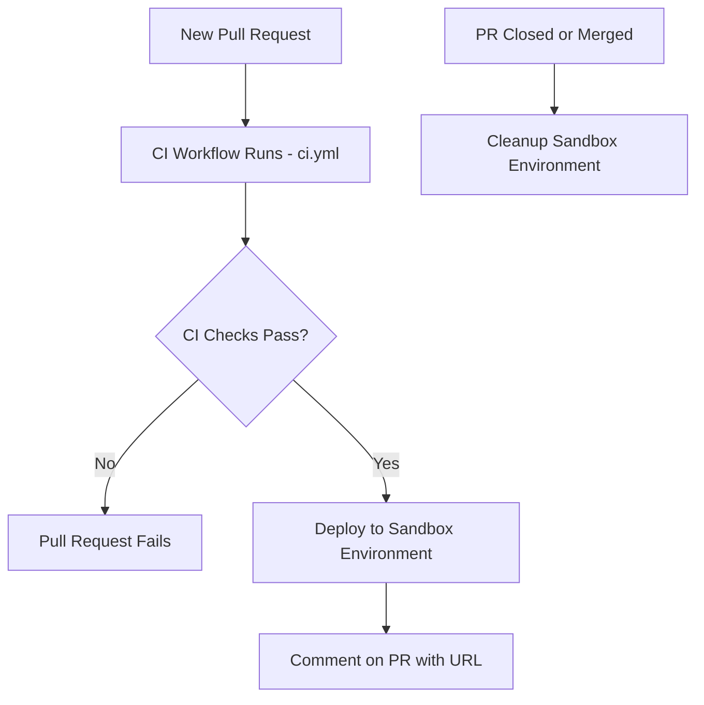
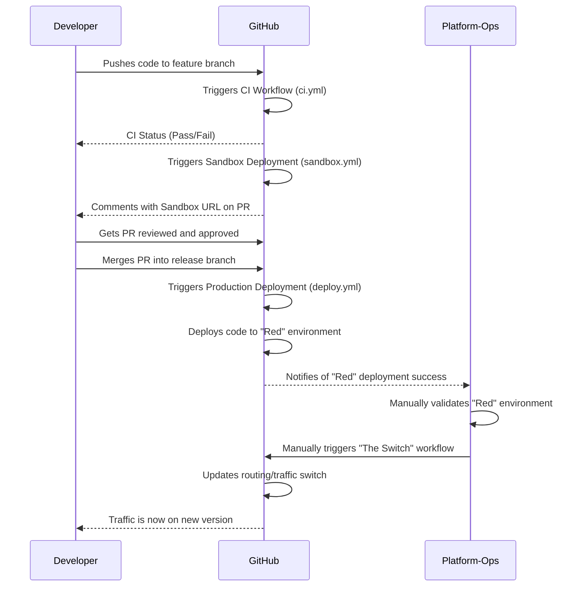

# Welcome to Our Internal Development Platform

This documentation is your guide to building and deploying services using our standardized IDP.

---

### 1. The Service Catalog

Our IDP uses Backstage's Service Catalog for all services. To get your service listed here, ensure your repository has a `catalog-info.yaml` file at its root.

---

### 2. Getting Started: Creating a New Service

To create a new service, do not start from scratch. Use our automated provisioning action.

Go to the **`idp-admin`** repository in our GitHub organization.
Click on the **Actions** tab.
Select the **`Create New Repository from Template`** workflow and click **`Run workflow`**.
Provide a name for your new service, and our automation will create a new repository with all the necessary files and CI/CD pipelines configured for you.

---

### 3. Development Workflow and Environments

Our IDP uses a Git-based workflow with automated deployments.

#### **Sandbox Environments**

**Purpose:** Sandbox environments are temporary, isolated environments for testing a new feature.

**How it works:** When you open a Pull Request, a GitHub Actions workflow is automatically triggered. It deploys your code to a unique sandbox URL. The URL will be posted as a comment on your PR.

**Access:** Use this URL to test your feature, share it with others for review, and ensure it works as expected before merging.

**Cleanup:** The sandbox environment is automatically deleted when the Pull Request is closed or merged.

**Visual Flow:**

#### **Production Deployments (Red/Green)**
Our production deployment strategy is designed for zero-downtime releases.

**Step 1**: Merge to release Branch: Once your feature has been tested in a sandbox and approved, merge your changes into the release branch. This triggers a GitHub Actions workflow to deploy your code to the "Red" (inactive) production environment.

**Step 2**: Validation: After the deployment is complete, a member of the Platform-Ops team will manually validate the "Red" environment.

**Step 3**: The Switch: The Platform-Ops team will then manually trigger a separate workflow to switch traffic from "Green" to "Red." The old "Green" environment is then available for the next deployment.

**Visual Flow:**

### 4. Retiring a Service
When a service is no longer needed, follow these steps to retire it properly:

1. Inform the Platform-Ops team and your stakeholders of the plan.
2. Trigger the archive workflow via GitHub Actions to de-provision all cloud resources.
3. Archive the GitHub repository in the repository's settings.

The archived service will remain in the Backstage catalog but will be marked as archived for future reference.
